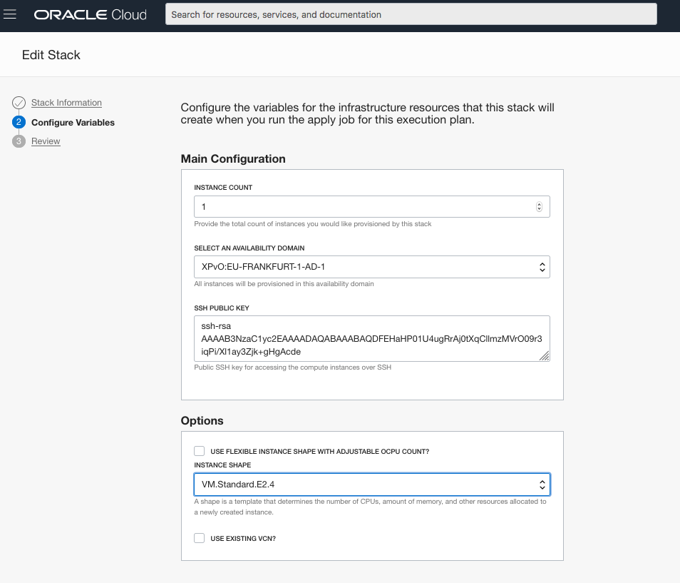
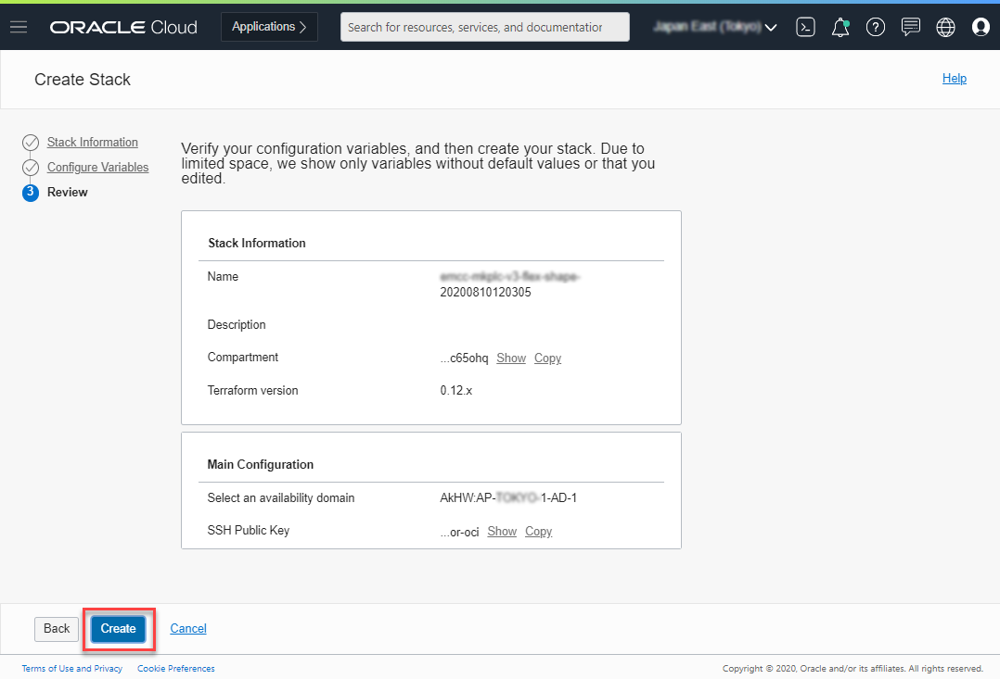
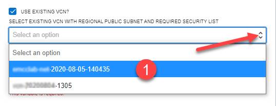
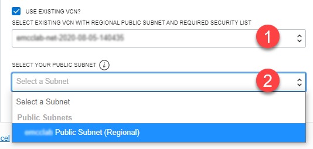
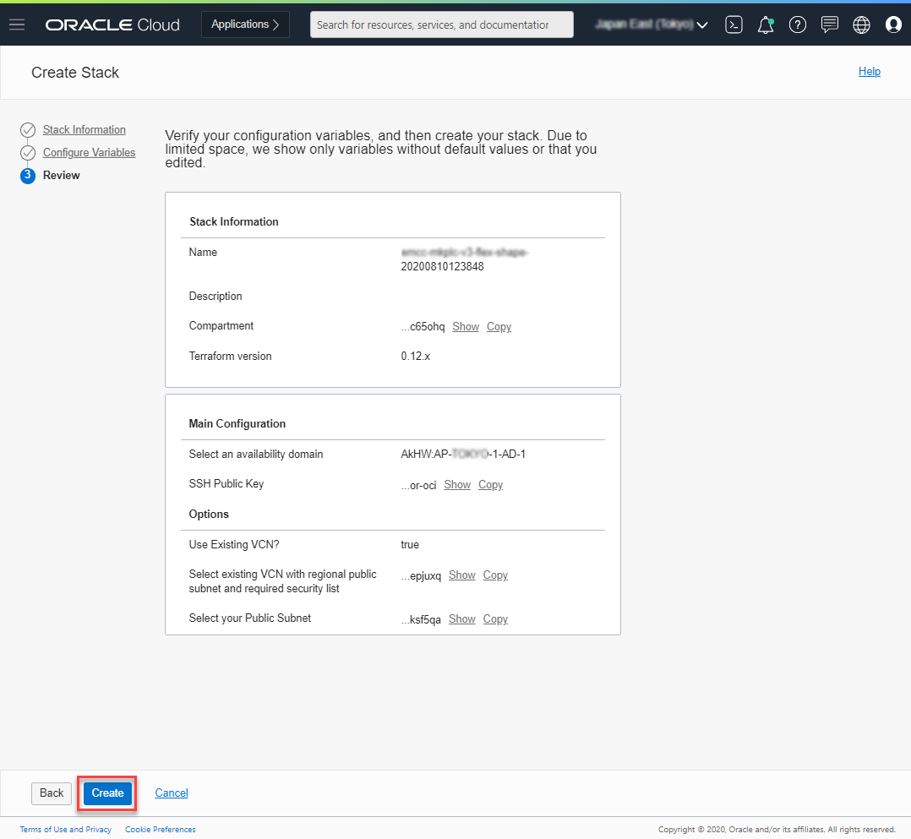
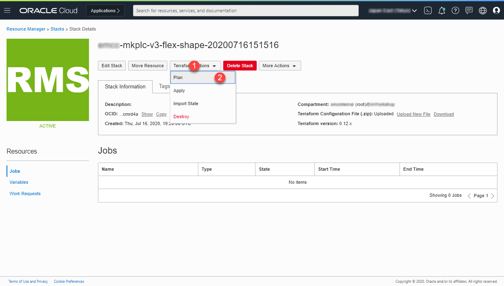
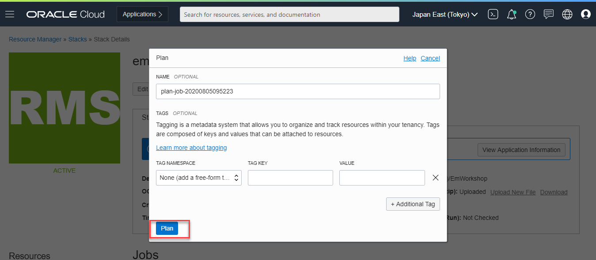
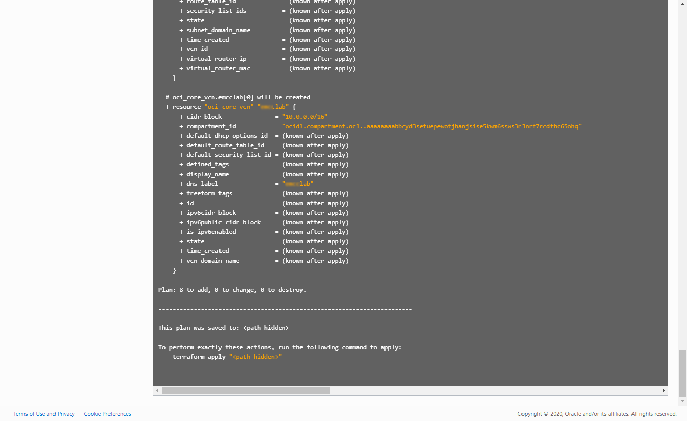
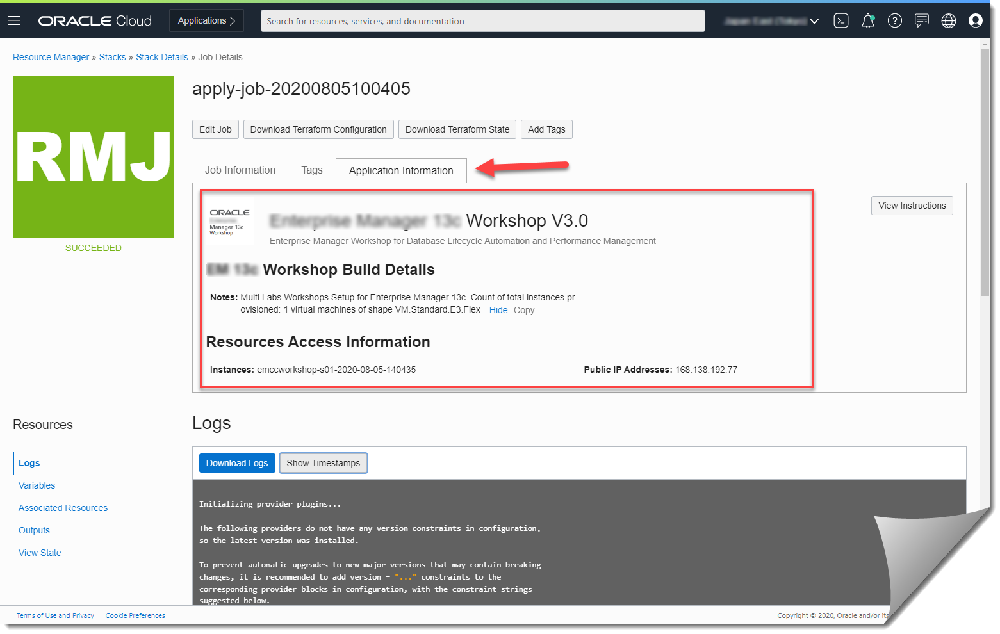
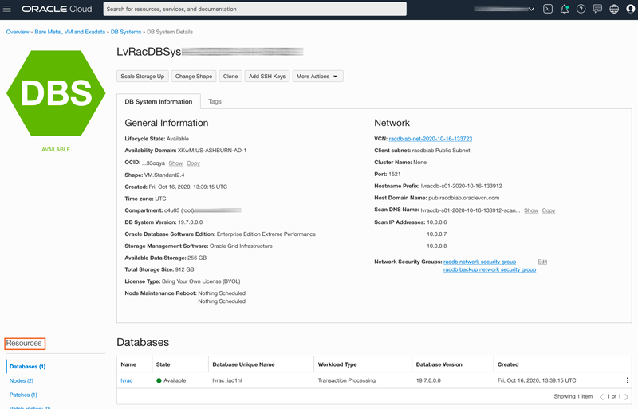

# Build a DB System

## Introduction
This lab will show you how to setup a Resource Manager stack that will generate the Oracle Cloud objects needed to run this workshop.  This workshop requires a DB System running a 2-node RAC database in a clustered environment a Virtual Cloud Network (VCN).

Estimated Lab Setup Time:  20 minutes (Execution Time - 2 hours)

### About Terraform and Oracle Cloud Resource Manager
For more information about Terraform and Resource Manager, please see the appendix below.

### Objectives
-   Create DB System + Networking Resource Manager Stack
-   Connect to the RAC database

### Prerequisites
- An Oracle LiveLabs or Paid Oracle Cloud account
- Lab: Generate SSH Keys 

## **STEP 1A**: Create Stack:  Compute + Networking

If you already have a VCN setup, proceed to *Step 1B*.

1.  Click on the link below to download the Resource Manager zip file you need to build your environment.  
- [dbsystemrac.zip](https://objectstorage.uk-london-1.oraclecloud.com/p/Wg4n8mJxd9bwfANNP1cHyTT95-6R201K0Z2VwDRFKcURy0H9mQhIrjIf8UM5rljE/n/lrojildid9yx/b/labtest_bucket/o/dbsystemrac.zip)

2.  Save in your downloads folder.
3.  Login to Oracle Cloud
4.  Open up the hamburger menu in the left hand corner.  Choose the compartment in which you would like to install.  Under the **Solutions and Platform** submenu, choose **Resource Manager > Stacks**.  

  

  

  

4.  Select **My Configuration**, click the **Browse** link and select the zip file (db\_system\_rac.zip) that you downloaded. Click **Select**.

  

5. Enter the following information:

      - **Name**:  Enter a name  or keep the prefilled default (*DO NOT ENTER ANY SPECIAL CHARACTERS HERE*, including periods, underscores, exclamation etc, it will mess up the configuration and you will get an error during the apply process)
      - **Description**:  Same as above
      - **Create in compartment**:  Select the correct compartment if not already selected

     *Note: If this is a newly provisioned tenant such as freetier with no user created compartment, stop here and first create it before proceeding.*

6.  Click **Next**.

  

7. Enter or select the following:
    - **Compartment:** Accept the default you entered initially
    - **Select Availability Domain:** Select an availability domain from the dropdown list.
    - **SSH Public Key**:  Paste the public key you created in the earlier lab
    - **DB System Node Shape**: Choose VMStandardE2.4, VMStandard2.4, or VMStandard2.2 (Note that choosing VMStandard2.2 may take some time to create the system)
    - **DB edition**: Enterprise Edition Extreme Performance is required for a RAC database
    - **Database Admin Password**: Database Admin Password must contain two UPPER-case characters, and two special characters (\_, \#) and be 12-30 characters in length (remember this value)
    - **Oracle Database Version**: Choose 19.7.0.0


    *Note: If you used the Oracle Cloud Shell to create your key, make sure you paste the pub file in a notepad, remove any hard returns.  The file should be one line or you will not be able to login to your compute instance*
8. Depending on the quota you have in your tenancy you can choose from standard Compute shapes or Flex shapes.  We recommend standard shapes unless you have run out of quota (Please visit the Appendix: Troubleshooting Tips for instructions on checking your quota)
    - **Use Flexible Instance Shape with Adjustable OCPU Count?:** Leave unchecked (unless you plan on using a Flex shape)
    - **Instance Shape:** Select VM.Standard.E2.4 (this compute instance requires at least 30 GB of memory to run, make sure to choose accordingly)
  
9. If you choose to use flex shapes, follow the instructions below.  Otherwise skip to the next step.
    - **Instance OCPUS:** Accept the default (**4**) This will provision the ***VM.Standard.E3.Flex*** shape with 4 OCPUs and 64GB of memory.

10. For this section we will provision a new VCN with all the appropriate ingress and egress rules needed to run this workshop.  If you already have a VCN, make sure it has all of the correct ingress and egress rules and skip to the next section.
     - **Use Existing VCN?:** Accept the default by leaving this unchecked. This will create a **new VCN**.

9. Click **Next**.

10. Review and click **Create**.

  

7. Your stack has now been created!  

  

You may now proceed to [Step 2](#STEP2:TerraformPlan(OPTIONAL)) (skip Step 1B).

## **STEP 1B**: Create Stack:  Compute only
If you just completed Step 1A, please proceed to [Step 2](#STEP2:TerraformPlan(OPTIONAL)).  If you have an existing VCN and are comfortable updating VCN configurations, please ensure your VCN meets the minimum requirements.  
- Egress rules for the following ports:  3000, 3001, 3003, 1521, 7007, 9090, 22          

If you do not know how to add egress rules, skip to the Appendix to add rules to your VCN.  *Note:  We recommend using our stack for ease of deployment and to reduce the potential for error.*

1. Click on the link below to download the Resource Manager zip file you need to build your environment.  
     - [db_system_rac.zip](https://objectstorage.uk-london-1.oraclecloud.com/p/pPV7w50bgS2qV-lLA7KQFEN4PN_ulXyrrYz1HbixQZw/n/lrojildid9yx/b/labtest_bucket/o/db_system_rac.zip)

2. Save in your downloads folder.
3. Open up the hamburger menu in the left hand corner.  Choose the compartment in which you would like to install.  Choose **Resource Manager > Stacks**.  

  

  

  

4. Select **My Configuration**, click the **Browse** link and select the zip file (converged-db-mkplc-freetier.zip) that you downloaded. Click **Select**.

  

  Enter the following information:
    - **Name**:  Enter a name  or keep the prefilled default (*DO NOT ENTER ANY SPECIAL CHARACTERS HERE*, including periods, underscores, exclamation etc, it will mess up the configuration and you will get an error during the apply process)
    - **Description**:  Same as above
    - **Create in compartment**:  Select the correct compartment if not already selected

  *Note: If this is a newly provisioned tenant such as freetier with no user created compartment, stop here and first create it before proceeding.*

5. Click **Next**.

  

    Enter or select the following:
    - **Compartment:** Accept the default you entered initially
    - **Select Availability Domain:** Select an availability domain from the dropdown list.
    - **SSH Public Key**:  Paste the public key you created in the earlier lab
    - **DB System Node Shape**: Choose VMStandardE2.4, VMStandard2.4, or VMStandard2.2 (Note that choosing VMStandard2.2 may take some time to create the system)
    - **DB edition**: Enterprise Edition Extreme Performance is required for a RAC database
    - **Database Admin Password**: Database Admin Password must contain two UPPER-case characters, and two special characters (\_, \#) and be 12-30 characters in length (remember this value)
    - **Oracle Database Version**: Choose 19.7.0.0

    *Note: If you used the Oracle Cloud Shell to create your key, make sure you paste the pub file in a notepad, remove any hard returns.  The file should be one line or you will not be able to login to your compute instance*

     - **Use Flexible Instance Shape with Adjustable OCPU Count?:** Keep the default by leaving checked to use ***VM.Standard.E3.Flex*** shape. If you prefer shapes of fixed OCPUs types, then check to select and use the default shown (***VM.Standard2.4***) or select the desired shape from the dropdown menu.
     - **Instance OCPUS:** Keep the default to **4** to provision ***VM.Standard.E3.Flex*** shape with 4 OCPU's.

     *Note: Instance OCPUS only applies to Flex Shapes and won't be displayed if you elect to use shapes of fixed OCPUs types*

     - **Use Existing VCN?:** Check to select.

     

     - **Select Existing VCN?:** Select existing VCN with regional public subnet and required security list.

     

     - **Select Public Subnet:** Select existing public subnet from above VCN.

     *Note: For an existing VCN Option to be used successful, review the details at the bottom of this section*

6. Review and click **Create**.

  

7. Your stack has now been created!  

  

## **STEP 2**: Terraform Plan (OPTIONAL)
This is optional, you may skip directly to [Step 3](#STEP3:TerraformApply).

When using Resource Manager to deploy an environment, execute a terraform **plan** to verify the configuration. 

1.  **[OPTIONAL]** Click **Terraform Actions** -> **Plan** to validate your configuration.  This takes about a minute, please be patient.

  

  

  

  

  

  

## **STEP 3**: Terraform Apply
When using Resource Manager to deploy an environment, execute a terraform **apply** to actually create the configuration.  Let's do that now.

1.  At the top of your page, click on **Stack Details**.  click the button, **Terraform Actions** -> **Apply**.  This will create your network (unless you opted to use and existing VCN) and the compute instance.

  

  

  

2.  Once this job succeeds, you will get an apply complete notification from Terraform.  Examine it closely, 8 resources have been added (3 only if using an existing VCN).  *If you encounter any issues running the terraform stack, visit the Appendix: Troubleshooting Tips section below.*

  

  

  

  

3.  Congratulations, your environment is created!  Click on the Application Information tab to get additional information about what you have just done.

  

4.  Your public IP address and instance name will be displayed.  Note the public IP address, you will need it for the next step.

## **STEP 4**: Find your IP Addresses

Before logging in, first note down your IP addresses.

1.  From the hamburger menu, select Bare Metal, VM, Exadata in the Oracle Database category. 

  

2.  Identify your database system and click it.  (Note:  Remember to choose the compartment that you were assigned if running on LiveLabs)

  

3. Explore the DB Systems home page.  On the left hand side, scroll down to view the Resources section.  Click Nodes.

  

4. Locate your two nodes and jot down their public IP addresses.

  

5. Now that you have your IP address select the method of connecting. Choose the environment where you created your ssh-key in the previous lab (Generate SSH Keys) and select one of the following steps.  We recommend you choose Oracle Cloud Shell for this series of workshops.
- [Step 5: Oracle Cloud Shell (RECOMMENDED)](#STEP5:OracleCloudShell)
- [Step 6: MAC or Windows CYGWIN Emulator](#STEP6:MACorWindowsCYGWINEmulator)
- [Step 7: Putty](#STEP7:WindowsusingPutty)

## **STEP 5**: Oracle Cloud Shell

1.  To re-start the Oracle Cloud shell, go to your Cloud console and click the Cloud Shell icon to the right of the region.  *Note: Make sure you are in the region you were assigned*

    

2.  Using one of the Public IP addresses in Step 4, enter the command below to login as the *opc* user and verify connection to your nodes.    

    ````
    ssh -i ~/.ssh/<sshkeyname> opc@<Your Public IP Address>
    ````
    

3.  When prompted, answer **yes** to continue connecting.
4.  Repeat step 2 for your 2nd node.
5.  You may now *proceed to the next lab*.  


## **STEP 6**: MAC or Windows CYGWIN Emulator
*NOTE:  If you have trouble connecting and are using your work laptop to connect, your corporate VPN may prevent you from logging in. Log out of your VPN before conneting. *
1.  Using one of the Public IP addresses in Step 4, open up a terminal (MAC) or cygwin emulator as the opc user.  Enter yes when prompted.

    ````
    ssh -i ~/.ssh/<sshkeyname> opc@<Your Public IP Address - node1>
    ````
    

2. You can also log in to the **Public IP Address of node2**

    ````
    ssh -i ~/.ssh/<sshkeyname> opc@<Your Public IP Address - node1>
    ````
    

3. After successfully logging in, you may *proceed to the next lab*

## **STEP 7**: Windows using Putty
*NOTE:  If you have trouble connecting and are using your work laptop to connect, your corporate VPN may prevent you from logging in. Log out of your VPN before conneting. *

On Windows, you can use PuTTY as an SSH client. PuTTY enables Windows users to connect to remote systems over the internet using SSH and Telnet. SSH is supported in PuTTY, provides for a secure shell, and encrypts information before it's transferred.

1.  Download and install PuTTY. [http://www.putty.org](http://www.putty.org)
2.  Run the PuTTY program. On your computer, go to **All Programs > PuTTY > PuTTY**
3.  Select or enter the following information:
    - Category: _Session_
    - IP address: _Your service instance’s (node1) public IP address_
    - Port: _22_
    - Connection type: _SSH_

  

### **Configuring Automatic Login**

1.  In the category section, **Click** Connection and then **Select** Data.

2.  Enter your auto-login username. Enter **opc**.

  

### **Adding Your Private Key**

1.  In the category section, **Click** Auth.
2.  **Click** browse and find the private key file that matches your VM’s public key. This private key should have a .ppk extension for PuTTy to work.

  

3.  To save all your settings, in the category section, **Click** session.
4.  In the saved sessions section, name your session, for example ( EM13C-ABC ) and **Click** Save.

### **Repeat Putty setup for the second node**

1. Repeat the steps upbove to create a login window for the second node - use the Public IP address of node2
3.  Select or enter the following information:
    - Category: _Session_
    - IP address: _Your service instance’s (node2) public IP address_
    - Port: _22_
    - Connection type: _SSH_

  

You may now *proceed to the next lab*.  

## Appendix:  Teraform and Resource Manager
Terraform is a tool for building, changing, and versioning infrastructure safely and efficiently.  Configuration files describe to Terraform the components needed to run a single application or your entire datacenter.  In this lab a configuration file has been created for you to build network and compute components.  The compute component you will build creates an image out of Oracle's Cloud Marketplace.  This image is running Oracle Linux 7.

Resource Manager is an Oracle Cloud Infrastructure service that allows you to automate the process of provisioning your Oracle Cloud Infrastructure resources. Using Terraform, Resource Manager helps you install, configure, and manage resources through the "infrastructure-as-code" model. To learn more about OCI Resource Manager, take a watch the video below.

[](youtube:udJdVCz5HYs)

### Oracle Cloud Marketplace
The Oracle Cloud Marketplace is a catalog of solutions that extends Oracle Cloud services.  It offers multiple consumption modes and deployment modes.  In this lab we will be deploying the free Oracle Enterprise Manager 13c Workshop marketplace image.

[Link to OCI Marketplace](https://www.oracle.com/cloud/marketplace/)

## Appendix: Troubleshooting Tips

If you encountered any issues during this lab, follow the steps below to resolve them.  If you are unable to resolve, please skip to the **Need Help** section to submit your issue via our  support forum.
- Availability Domain Mismatch
- Limits Exceeded
- Invalid public key
- Flex Shape Not Found

### Issue 1: Availability Domain Mismatch


#### Issue #1 Description
When creating a stack and using an existing VCN, the availability domain and the subnet must match otherwise the stack errors.  

#### Fix for Issue #1
1.  Click on **Stack**-> **Edit Stack** -> **Configure Variables**.
2.  Scroll down to the network definition.
3.  Make sure the Availability Domain number matches the subnet number.  E.g. If you choose AD-1, you must also choose subnet #1.
4.  Click **Next**
5.  Click **Save Changes**
6.  Click **Terraform Actions** -> **Apply**

### Issue 2: Invalid public key


#### Issue #2 Description
When creating your SSH Key, if the key is invalid the compute instance stack creation will throw an error.

#### Tips for fixing for Issue #2
- Go back to the instructions and ensure you create and **copy/paste** your key into the stack correctly.
- Copying keys from Cloud Shell may put the key string on two lines.  Make sure you remove the hard return and ensure the key is all one line.
- Ensure you pasted the *.pub file into the window.
1.  Click on **Stack**-> **Edit Stack** -> **Configure Variables**.
2.  Repaste the correctly formatted key
3.  Click **Next**
4.  Click **Save Changes**
5.  Click **Terraform Actions** -> **Apply**

### Issue 3: Flex Shape Not Found


#### Issue #3 Description
When creating a stack your ability to create an instance is based on the capacity you have available for your tenancy.

#### Fix for Issue #3
If you have other compute instances you are not using, you can go to those instances and delete them.  If you are using them, follow the instructions to check your available usage and adjust your variables.
1. Click on the Hamburger menu, go to **Governance** -> **Limits, Quotas and Usage**
2. Select **Compute**
3. These labs use the following compute types.  Check your limit, your usage and the amount you have available in each availability domain (click Scope to change Availablity Domain)
4. Look for Standard.E2, Standard.E3.Flex and Standard2
4.  Click on the hamburger menu -> **Resource Manager** -> **Stacks**
5.  Click on the stack you created previously
6.  Click **Edit Stack** -> **Configure Variables**.
7.  Scroll down to Options
8.  Change the shape based on the availability you have in your system
9.  Click **Next**
10. Click **Save Changes**
11. Click **Terraform Actions** -> **Apply**

### Issue 4: Limits Exceeded


#### Issue #4 Description
When creating a stack your ability to create an instance is based on the capacity you have available for your tenancy.

#### Fix for Issue #4
If you have other compute instances you are not using, you can go to those instances and delete them.  If you are using them, follow the instructions to check your available usage and adjust your variables.

1. Click on the Hamburger menu, go to **Governance** -> **Limits, Quotas and Usage**
2. Select **Compute**
3. These labs use the following compute types.  Check your limit, your usage and the amount you have available in each availability domain (click Scope to change Availablity Domain)
4. Look for Standard.E2, Standard.E3.Flex and Standard2
5. This workshop requires at least 4 OCPU and a minimum of 30GB of memory.  If you do not have that available you may request a service limit increase at the top of this screen.  If you have located capacity, please continue to the next step.
6.  Click on the Hamburger menu -> **Resource Manager** -> **Stacks**
7.  Click on the stack you created previously
8.  Click **Edit Stack** -> **Configure Variables**.
9.  Scroll down to Options
10. Change the shape based on the availability you have in your system
11. Click **Next**
12. Click **Save Changes**
13. Click **Terraform Actions** -> **Apply**

## Acknowledgements

* **Author** - Rene Fontcha, Master Principal Platform Specialist, NA Technology
* **Contributors** - Kay Malcolm, Product Manager, Database Product Management
* **Last Updated By/Date** - Kay Malcolm, October 2020

## Need Help?
Please submit feedback or ask for help using our [LiveLabs Support Forum](https://community.oracle.com/tech/developers/categories/oracle-maa-dataguard-rac). Please click the **Log In** button and login using your Oracle Account. Click the **Ask A Question** button to the left to start a *New Discussion* or *Ask a Question*.  Please include your workshop name and lab name.  You can also include screenshots and attach files.  Engage directly with the author of the workshop.

If you do not have an Oracle Account, click [here](https://profile.oracle.com/myprofile/account/create-account.jspx) to create one.
